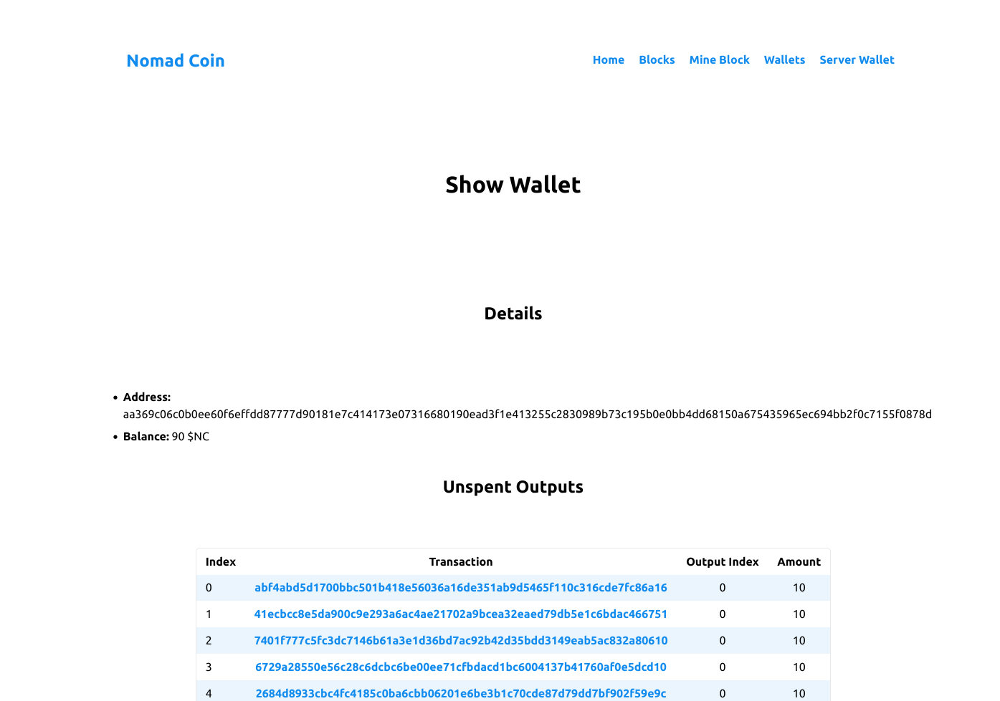
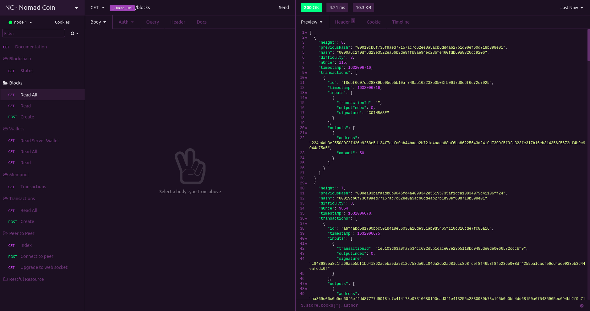
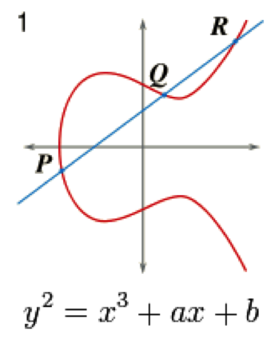
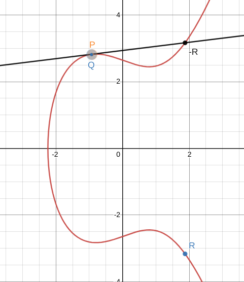
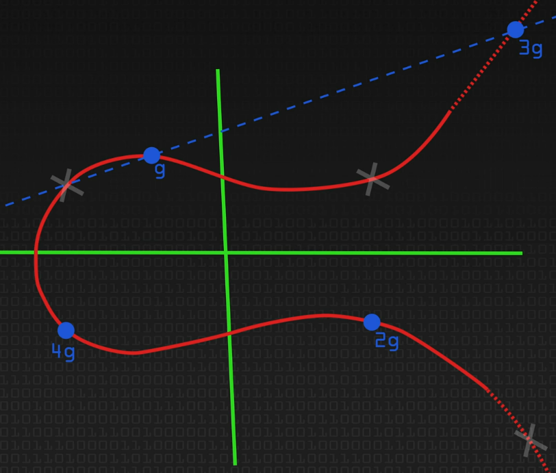
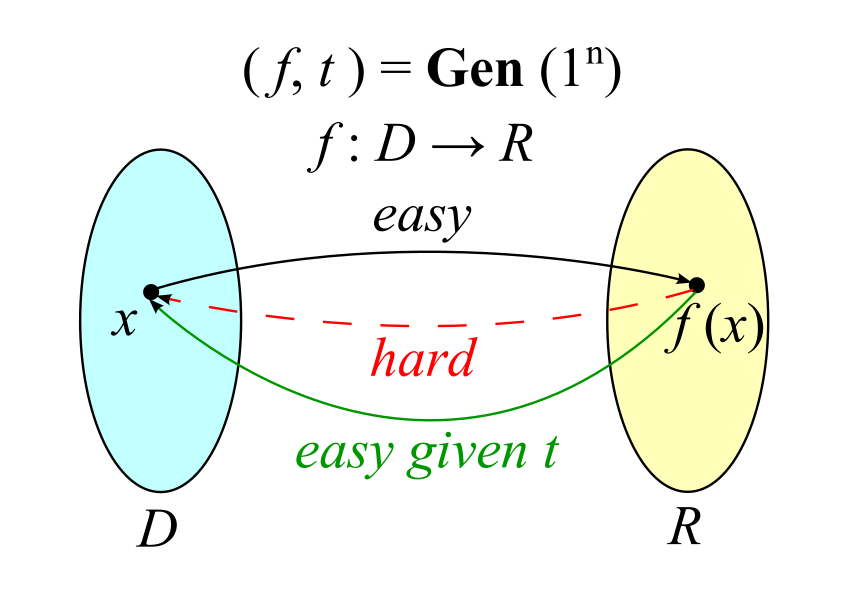
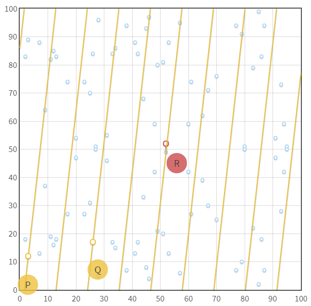

# Nomad Coders - Nomad Coin

<p align="center">
    
</p>

## Table of Contents

- [About](#about)
- [Getting Started](#getting_started)
- [Usage](#usage)
- [Notes](#notes)
- [Libs](#libs)
- [Docs](#docs)
- [Resources](#resources)

## About <a name = "about"></a>

A fully-featured blockchain and cryptocurrency using the Go programming language.

- [Take the course too!](https://nomadcoders.co/nomadcoin)
- [Certificate of Completion](https://nomadcoders.co/certs/36d6a10c-265c-47ef-85c3-93c34bede4dc)
- [Original code](https://github.com/nomadcoders/nomadcoin)

### Features

- [x] HTML Explorer
- [x] REST API
- [x] CLI
- [x] Database Backend
- [x] Mining
- [x] Transactions
- [x] Wallets
- [x] P2P (Websockets)
- [x] Unit Testing

### Future

- [x] Finish README Notes
- [ ] Verify Transactions
- [ ] Verify Peer Blocks
- [ ] Fully Tested

## Getting Started <a name = "getting_started"></a>

### Go environment

Install the latest version of `Go` with the `asdf` version manager:

```bash
$ cd
$ git clone https://github.com/asdf-vm/asdf.git ~/.asdf
$ cd ~/.asdf
$ git checkout "$(git describe --abbrev=0 --tags)"

# For Ubuntu or other linux distros
$ echo '. $HOME/.asdf/asdf.sh' >> ~/.bashrc
$ echo '. $HOME/.asdf/completions/asdf.bash' >> ~/.bashrc
$ source ~/.bashrc

$ asdf plugin-add golang https://github.com/kennyp/asdf-golang.git
$ asdf install golang latest
$ asdf list
$ asdf global golang 1.17.1
$ asdf current
$ go help
```

### Installing

```bash
$ git clone https://github.com/librity/nc_nomadcoin
$ cd nc_nomadcoin
$ go get
$ asdf reshim golang
$ go run main.go both
```

### Analyze race conditions

Automagically analyze race conditions during execution:

```bash
$ go run -race main.go rest -port=5001
$ go run -race main.go rest -port=5002
# or
$ go build -race && nc_nomadcoin rest -port=5001
$ go build -race && nc_nomadcoin rest -port=5002
```

### Godocs

You can browse the documentation of all local packages and projects with the
[Godocs](https://pkg.go.dev/golang.org/x/tools/godoc#section-readme)
package:

```bash
$ go install golang.org/x/tools/godoc
$ godoc -http=:6060
```

This will install the executable
and start a server listening on http://localhost:6060

### Testing

Run all tests with coverage report:

```bash
$ go test -v -coverprofile cover.out ./... && go tool cover -html=cover.out
```

## Usage <a name = "usage"></a>

### CLI

```bash
$ go run main.go rest -port=PORT                # Start the REST API (recommended)
$ go run main.go explorer -port=PORT            # Start the HTML Explorer
$ go run main.go both -ePort=PORT -rPort=PORT   # Start both REST API and HTML Explorer
```

### HTML Explorer

A simple webserver that lets you browse all the blocks,
transactions and wallets.

- http://localhost:4000

<p align="center">
    
</p>

### REST API

It has the same functionality of the HTML Explorer.
It also lets you create transactions, mine blocks, and list connected peers.

- http://localhost:5001

<p align="center">
    
</p>

## Notes <a name = "notes"></a>

### Golang is awesome

I really enjoy Go, it's probably my favorite language right now.
It blows me away how easy it is to write and refactor code
using VSCode's Go extension.
I'm catching over 95% of bugs and errors before compilation.
I only ever need to worry about:

- Data races
- Deadlocks
- Uninitialized `map`s and `*`pointers
- Functions that receive `interface{}`s params

Every other mistake gets highlighted the moment I type it.
Golang only surprises me when it doesn't work.

### Go Routines and Channels

- Reading from a channel without an active go routines will create a panic.
- Reading from a closed channel will return `nil`
  or the type equivalent (`0`, `""`, etc.)
- Closing a closed channel will create a panic.
- Sending to a closed channel will create a panic.
- Channels can be Read-only (`<-chan`) or Send-only (`chan<-`).
- Both sending and receiving are blocking operations
  for unbuffered channels.
- Buffered channels have a non-blocking queue of messages
  (`make(chan int, BUFFER_SIZE)`).
  Sending and receiving become blocking operations once the queue is full.

### One-way hash functions

Deterministic, easy to compute, hard to invert:

```go
hashFunction("sexy") => "dsdj21321wq0wjdw0jw9djcosaniqij0"
hashFunction("sexy") => "dsdj21321wq0wjdw0jw9djcosaniqij0"
hashFunction("sexyy") => "ri3j9rj2302j0ginvin0n00ivwn0inv0u"
inverseHashFunction("ri3j9rj2302j0ginvin0n00ivwn0inv0u") => UNDEFINED
```

Many examples exists: MD5, SHA-X, Whirlpool, BLAKEX, etc.
Like Bitcoin, we use SHA-256.

### Blockchain

```go
newBlockHash := hashFunction(NOnce + previousBlockHash + timestamp + ...)
```

`data` could be anything, usually transactions and smart contracts.
Any alteration to a previous block's data will
avalanche obvious changes to the next blocks' hashes.
This makes it so any node in the network can locally verify the integrity
of the blockchain.

Bitcoin has its own
[Block hashing algorithm](https://en.bitcoin.it/wiki/Block_hashing_algorithm),
where a header of 80 bytes (containing bitcoin version number,
the previous block hash, the hash of the block's transactions, the timestamp,
the difficulty, and the NOnce) is hashed.
In our implementation we transform the entire block instance
to Golang's default string representation and hash that.

### Mining (Proof of Work)

The only thing a miner is allowed to change in a block
(besides adding transactions) is a special number called _NOnce_.
The objective of mining is to change the value of the _NOnce_ so that
the block has a hash that start with a determined number of zeros.

The amount of zeroes required to mine a block determines the difficulty
of the blockchain, and is adjusted by some mechanism
determined by the developer.
This consensus mechanisms is called _Proof of Work_,
and it's the one used by most cryptocurrencies.
The other major one is _Proof of stake_.
You can play with this mining simulator to get a better idea:

- https://mining-simulator.netlify.app/

### Accounting model

We use the UTXO (Unspent Transaction Output) accounting model,
the same one used in BitCoin and Cardano.

Coins are created by a special type of transaction: the coinbase transaction.

```go
type Transaction struct {
	Id     string
	Input  []string
	Output []string
}

coinbaseTx = Transaction{
	Id:     "0001"
	Input:  []string{"$10(blockchain)"},
	Output: []string{"$10(miner)"},
}
```

Transactions have multiple inputs and outputs.
Input is the money you have before the transaction.
Output is the money everyone has by the end of the transaction.

```go
txs := []Transaction{}
txs = append(txs, Transaction{
	Id:     "0002"
	Input:  []string{"$10(lior),txId(0001)"},
	Output: []string{"$1(drugDealer)", "$2(landLord)", "$7(lior)"},
})
txs = append(txs, Transaction{
	Id:     "0003"
	Input:  []string{"$7(lior),txId(0002)"},
	Output: []string{"$7(waiFu)"},
})
```

A transaction Input is a reference to a previous transaction Output.
We can only use an Input from a previous Output
that's not being used by another transaction in the blockchain or the mempool:
An Output becomes "spent" once it's referenced by an Input.

### Mempool

Unconfirmed transactions wait on the _Mempool_ until they are added
to the blockchain by miners, becoming confirmed.

### Digital signing

1. Hash any digital object (string, picture, json, etc.)
2. Generate a Public-Private key pair
3. Sign the hash with the private key
4. Verify signature with the public key

```go
messageHash := hashFunction("i like turtles")
publicKey, privateKey := makeNewKeys()
signature := sign(messageHash, privateKey)
checksOut := verify(messageHash, signature, publicKey)
```

All these functions are cryptographic black boxes made with very cool math.
There are
[many different](https://en.wikipedia.org/wiki/Public-key_cryptography#Examples)
Public-key cryptography algorithms with which to sign and verify data.
We will use Elliptic-curve cryptography
with the [NIST P-256](https://neuromancer.sk/std/nist/P-256) curve,
while Bitcoin uses [Secp256k1](https://en.bitcoin.it/wiki/Secp256k1).

### Elliptic Curve Cryptography

We start with some Elliptic curve `E`, a set of points defined by an equation:

<p align="center">
    
</p>

The overall shape of the curve is determined by the real numbers `a` and `b`.
There's a lot of active research that goes into finding curves
without any backdoors and that are hard to brute force.

Because Elliptic curves are Algebraic groups,
we can add two arbitrary curve points `P` and `Q` and get the curve point `R`:

<p align="center">
  
</p>

If we make `P = Q`, `R` will equal the mirror(negative) of the interception
of the the tangent line at `P` with the curve, or `2P`:

<p align="center">
    
</p>

We can then add some arbitrary point `G` to itself as many `d` times as we want,
and we will always end up with another point in the curve `d . G`.
We've just invented scalar multiplication of an elliptic curve point:

<p align="center">
    
</p>

The bigger `d` gets, the more points in the curve we end up hitting
before reaching the point `d . G`.
This bouncing around the curve looks very pseudo-random,
much like the modular arithmetic of Diffie–Hellman key exchange algorithm.

The point of this is that it's computationally impractical
to calculate the value of `d` from `d . G`, given a large-enough `d`.
It's also very easy for a computer to generate `d . G` from `d` and `G`.
This is very similar to a hash function,
in that the output is practically non-invertible:

```go
ellipticCurveScalarMultiplication(G, d) => x, y
inversEellipticCurveScalarMultiplication(x, y) => UNDEFINED
```

<p align="center">
    
</p>

These "trapdoor function" are the basis of asymmetric cryptography schemes.
When you generate a Private ECDSA key, you are picking a random number `d`
between zero and a very large prime `n`.
The computer then traverses the curve by adding `G` to itself `d` times,
generating the Public Key `K` of coordinates `(x,y)`.

With these two asymmetric keys we can securely:

- [Exchange secrets over an insecure channel](https://en.wikipedia.org/wiki/Elliptic-curve_Diffie%E2%80%93Hellman)
- [Encrypt and Decrypt arbitrary data](https://en.wikipedia.org/wiki/Integrated_Encryption_Scheme)
- [Sign and Verify arbitrary data](https://en.wikipedia.org/wiki/Elliptic_Curve_Digital_Signature_Algorithm)

There's some miscellaneous mathematical trickery to make this
more secure and/or efficient, but this is fundamentally how it works.

We often project the curve over a finite field `n`,
which is a very large prime number.
This means that we perform the scalar multiplication of the points,
then take the modulus `n` of the result.
This turn it into a map of discrete values, or affine points:

<p align="center">
  
</p>

<p align="center">
    
</p>

### Elliptic Curve Digital Signature Algorithm (ECDSA)

Alice wants to send a message `M` to Bob.
They both agree on an Elliptic curve `E`, a generator point `G` on the curve,
and a very large prime number `n`.

#### Generate Keys

Alice generates the Private key `a`
by picking a very large number between 1 and `n-1`.
She then generates the Public key `P` and sends it to Bob.

<p align="center">
  
</p>

#### Sign

Alice calculates the message hash `e` and transforms it into a number `z`
by taking the leftmost bits of `e`.

<p align="center">
  
</p>

She then picks another random number `k` between 1 and `n-1`
(called the NOnce because it's only used once),
and multiplies it with `G` modulus `n` to get the coordinate `r`,
the first part of the signature.

<p align="center">
  
</p>

The second part of the signature `s` is a combination of `k`, `r`, `z` and
the private key `a`:

<p align="center">
  
</p>

Alice then sends Bob the message `M`, the hash `e` and the signature `(r, s)`.

#### Verify

Bob does some basic verifications of the public key `P`,
like checking that it's on the curve and it's not the Identity Element `O`.
He then checks that `r` and `s` are integers between 1 and `n-1`,
and that `e` is the hash of `M`.

He then calculates `z` from `e` the same way Alice did,
and uses it to calculate `u1` and `u2`:

<p align="center">
  
</p>

And with the public key `P` calculates
the coordinate `x1` of the signature point:
if `x1` is congruent to `r` modulo `n`
(which means the same as `x1` and `r` differ by a multiple of `n`)
then the signature is valid.

<p align="center">
  
</p>

If we didn't project the curve `E` on a field `n`
(if we didn't modulate the operations),
the private key `a` would be recoverable from the signature `(r, s)`,
the hash `e` and the value of `k`.
This is also why we pick a new random value of `k` for every signature.

How we securely generate random values of `a` and `k` is an important problem,
and one that's exploitable by back doors like the one in
[Dual_EC_DRBG](https://en.wikipedia.org/wiki/Dual_EC_DRBG),
a random number generator that the NSA (((probably))) bugged.

We'd probably still be using that garbage if it wasn't for The Brave
[Edward Snowden](https://en.wikipedia.org/wiki/Edward_Snowden).

<p align="center">
    
</p>

### Data races

Data races can occur when:

- two or more threads (go routines in this case) in a single process
  access the same memory location concurrently, and
- at least one of the accesses is for writing, and
- the threads are not using any exclusive locks
  to control their accesses to that memory.

When these three conditions hold, the order of accesses is non-deterministic,
and the computation may give different results from run to run
depending on that order.
[Source](https://docs.oracle.com/cd/E19205-01/820-0619/geojs/index.html)

In Golang we fix data races with blocking `chan`nels,
`sync.WaitGroup` or `sync.Mutex`.
They all do pretty much the same thing:
lock the variable during read and write
to guarantee that only one routine access it at a time.

### Peer 2 Peer

This the most important part of understanding blockchain.
Bitcoin is fundamentally a peer 2 peer protocol that allows
a decentralized network to agree on the data that will be added
to a write-only database.

We use [Web Sockets](https://github.com/gorilla/websocket)
to connect the peers and broadcast new transactions and mined blocks.

When node Jr. connects to node Sr., node Jr. send the last block it has.
Node Sr. then checks whether Jr. is ahead, behind or on the same block as Jr.
Whichever one's ahead end up sending a copy of their blockchain to the other.
Then they share a list of the other nodes they're connected to,
and initiate this handshake again.

When someone creates a transaction in a node it broadcasts
to all the other nodes, creating a "Global Mempool".
Each node then receives the transaction and verifies the transaction's
signature: if it's valid the transaction is added to the Mempool
and relayed to the other nodes.

The nodes then try to mine the next block, and the one that get's lucky
broadcasts the block to all other.
The other nodes verify the new block's nonce and transactions:
if it's valid it is added to the local blockchain
and relayed to the other nodes.

### Cryptocurrency Investment Advice

```diff
- THIS IS NOT INVESTMENT ADVICE.
- I'M NOT RESPONSIBLE FOR YOUR BAD DECISIONS.
```

This what I've gathered from all my research, merely my opinion:

- Only bet what you can afford to loose.
- Don't bet on anything you don't understand.
- Don't bet on anything you haven't read the code.
- Don't bet on new currencies if you don't understand
  the problems they're trying to solve
  and what they're doing differently.
- A blockchain is only as good as its dev community.
- Bet on engineering, not marketability.
- "I'm an adult and everything I do is my responsibility."
- Don't be this guy:

[](https://youtu.be/61i2iDz7u04)

_To his credit, it's pretty unreasonable to expect someone
without any technical knowledge
to successfully speculate on shitcoins._

## Libs <a name = "libs"></a>

- https://github.com/gorilla/mux
- https://github.com/gorilla/websocket
- https://github.com/etcd-io/bbolt
- https://golang.org/x/tools/godoc

## Docs <a name = "docs"></a>

- https://pkg.go.dev/fmt#Printf
- https://pkg.go.dev/sync#Once
- https://pkg.go.dev/net/http#HandleFunc
- https://pkg.go.dev/log#Fatal
- https://pkg.go.dev/text/template#hdr-Actions
- https://pkg.go.dev/html/template#ParseFiles
- https://pkg.go.dev/path/filepath#Match
- https://pkg.go.dev/encoding/json#Marshal
- https://pkg.go.dev/strconv#Atoi
- https://pkg.go.dev/flag#NewFlagSet
- https://pkg.go.dev/encoding/gob
- https://pkg.go.dev/crypto/elliptic#P256
- https://pkg.go.dev/encoding/hex#DecodeString
- https://pkg.go.dev/math/big#Int
- https://pkg.go.dev/crypto/x509#MarshalECPrivateKey
- https://pkg.go.dev/os#WriteFile
- https://pkg.go.dev/builtin#close
- https://pkg.go.dev/testing
- https://pkg.go.dev/std
- https://pkg.go.dev/golang.org/x/tools/godoc
- https://golang.org/doc/
- https://golang.org/ref/spec#Variables
- https://golang.org/ref/spec#Pointer_types
- https://tour.golang.org/methods/17
- https://go.dev/blog/maps

## Resources <a name = "resources"></a>

- https://andybrewer.github.io/mvp/?ref=producthunt
- https://en.wikipedia.org/wiki/Marshalling_(computer_science)
- https://swagger.io/specification/
- https://en.wikipedia.org/wiki/Adapter_pattern
- https://developer.mozilla.org/en-US/docs/Web/HTTP/Status
- https://marketplace.visualstudio.com/items?itemName=humao.rest-client
- https://stackoverflow.com/questions/4279611/how-to-embed-a-video-into-github-readme-md

### Key-value DB

- https://en.wikipedia.org/wiki/Key%E2%80%93value_database
- https://github.com/google/leveldb
- https://github.com/LMDB/lmdb
- https://github.com/evnix/boltdbweb
- https://github.com/br0xen/boltbrowser

### Blockchain

- https://www.youtube.com/playlist?list=PL7jH19IHhOLOJfXeVqjtiawzNQLxOgTdq
- https://github.com/LarryRuane/minesim
- https://mining-simulator.netlify.app/
- https://www.blockchain.com/explorer
- https://github.com/tensor-programming/golang-blockchain/tree/part_10
- https://www.youtube.com/playlist?list=PLmL13yqb6OxdEgSoua2WuqHKBuIqvll0x

### Go

- https://www.digitalocean.com/community/tutorials/understanding-data-types-in-go
- https://stackoverflow.com/questions/25161774/what-are-conventions-for-filenames-in-go
- https://medium.com/golangspec/labels-in-go-4ffd81932339
- https://stackoverflow.com/questions/33832762/how-do-i-make-a-go-program-wait-until-there-is-user-input
- https://stackoverflow.com/questions/37242009/function-returns-lock-by-value

### Go strings

- https://golang.org/src/strconv/atoi.go?h=Atoi
- https://golangdocs.com/generate-random-string-in-golang
- https://stackoverflow.com/questions/22892120/how-to-generate-a-random-string-of-a-fixed-length-in-go
- https://stackoverflow.com/questions/59402587/how-to-get-enum-variable-name-by-value-in-golang
- https://embeddedartistry.com/blog/2017/07/05/printf-a-limited-number-of-characters-from-a-string/

### Go gobs

- https://gist.github.com/miguelmota/2a0c0e96c22bccc8740819d5d64ff8d0
- https://stackoverflow.com/questions/14121422/de-and-encode-interface-with-gob
- https://go.dev/blog/gob
- https://gist.github.com/evalphobia/a2ba2636acbc112f68dcd89e8b81d349
- https://developpaper.com/golang-gob-code-detailed-explanation-of-gob-package/

### Go HTTP

- https://hackthedeveloper.com/golang-server-static-files/
- https://golangdocs.com/golang-mux-router
- https://stackoverflow.com/questions/40478027/what-is-an-http-request-multiplexer

### Go maps

- https://golangdocs.com/maps-in-golang
- https://stackoverflow.com/questions/27267900/runtime-error-assignment-to-entry-in-nil-map
- https://stackoverflow.com/questions/14928826/passing-pointers-to-maps-in-golang
- https://stackoverflow.com/questions/2809543/pointer-to-a-map

### Go import cycles

- https://jogendra.dev/import-cycles-in-golang-and-how-to-deal-with-them
- https://stackoverflow.com/questions/38412950/golang-import-cycle-not-allowed

### Go arrays & slices

- https://github.com/golang/go/wiki/SliceTricks#reversing
- https://stackoverflow.com/questions/24757814/golang-convert-byte-array-to-big-int
- https://stackoverflow.com/questions/37334119/how-to-delete-an-element-from-a-slice-in-golang
- https://stackoverflow.com/questions/19239449/how-do-i-reverse-an-array-in-go
- https://stackoverflow.com/questions/54858529/golang-reverse-a-arbitrary-slice

### Go packages

- https://www.gorillatoolkit.org/
- https://dbdb.io/db/boltdb
- https://github.com/boltdb/bolt
- https://cobra.dev/
- https://gobuffalo.io/en/

### Go templates

- https://gowebexamples.com/templates/
- https://blog.gopheracademy.com/advent-2017/using-go-templates/
- https://stackoverflow.com/questions/29762118/range-over-array-index-in-templates
- https://stackoverflow.com/questions/25689829/arithmetic-in-go-templates
- https://stackoverflow.com/questions/17843311/template-and-custom-function-panic-function-not-defined
- https://stackoverflow.com/questions/38686583/golang-parse-all-templates-in-directory-and-subdirectories

### Go data races

- https://docs.oracle.com/cd/E19205-01/820-0619/geojs/index.html
- https://en.wikipedia.org/wiki/Race_condition
- https://www.sohamkamani.com/golang/data-races/
- https://yourbasic.org/golang/data-races-explained/
- https://programming.guide/go/data-races-explained.html
- https://programming.guide/go/detect-data-races.html

### Go deadlocks

- https://yourbasic.org/golang/detect-deadlock/
- https://stackoverflow.com/questions/56051910/using-mutex-lock-still-deadlock
- https://awesomeopensource.com/project/sasha-s/go-deadlock
- https://github.com/sasha-s/go-deadlock
- https://stackoverflow.com/questions/68144512/identifying-golang-deadlock-5-philosophers-problem
- https://wavded.com/post/golang-deadlockish/
- https://programming.guide/go/detect-deadlock.html

### Go big.Int

- https://medium.com/orbs-network/big-integers-in-go-14534d0e490d
- https://blog.devgenius.io/big-int-in-go-handling-large-numbers-is-easy-157cb272dd4f
- https://stackoverflow.com/questions/44696881/big-int-not-equal-to-one-received-after-big-setbytesbigint-bytes

### Go testing

- https://golangdocs.com/golang-unit-testing
- https://stackoverflow.com/questions/32425558/how-to-verify-if-a-specific-function-is-called
- https://www.youtube.com/watch?v=ndmB0bj7eyw
- https://stackoverflow.com/questions/31595791/how-to-test-panics
- https://stackoverflow.com/questions/24375966/does-go-test-run-unit-tests-concurrently
- https://pkg.go.dev/github.com/stretchr/testify/assert?utm_source=godoc
- https://stackoverflow.com/questions/31201858/how-to-run-golang-tests-sequentially
- https://github.com/stretchr/testify

### Go crypto

- https://golang.org/src/crypto/
- https://golangdocs.com/the-crypto-rand-package-in-golang
- https://www.thepolyglotdeveloper.com/2018/02/encrypt-decrypt-data-golang-application-crypto-packages/
- https://kashifsoofi.github.io/cryptography/aes-in-go-using-crypto-package/
- https://golangdocs.com/rsa-encryption-decryption-in-golang
- https://yourbasic.org/golang/crypto-rand-int/
- https://golang.hotexamples.com/examples/crypto.ecdsa/-/Verify/golang-verify-function-examples.html
- https://teemukanstren.com/2018/04/16/trying-to-learn-ecdsa-and-golang/
- https://golang.hotexamples.com/examples/crypto.ecdsa/-/Sign/golang-sign-function-examples.html
- https://www.youtube.com/watch?v=jgTqR8PuWuU

### Cryptography

- https://en.wikipedia.org/wiki/Computational_complexity_theory#Intractability
- https://en.wikipedia.org/wiki/Trapdoor_function
- https://en.wikipedia.org/wiki/Finite_field
- https://en.wikipedia.org/wiki/Modular_arithmetic
- https://en.wikipedia.org/wiki/Integer_factorization

### Hash Functions

- https://en.wikipedia.org/wiki/Hash_function
- https://en.wikipedia.org/wiki/Cryptographic_hash_function
- https://en.wikipedia.org/wiki/SHA-2
- https://en.wikipedia.org/wiki/One-way_function

### Encryption

- https://en.wikipedia.org/wiki/End-to-end_encryption
- https://en.wikipedia.org/wiki/Encryption
- https://en.wikipedia.org/wiki/RSA_(cryptosystem)
- https://en.wikipedia.org/wiki/Advanced_Encryption_Standard
- https://en.wikipedia.org/wiki/Galois/Counter_Mode
- https://en.wikipedia.org/wiki/Block_cipher
- https://www.youtube.com/watch?v=O4xNJsjtN6E

### Public-key cryptography

- https://en.wikipedia.org/wiki/Public-key_cryptography
- https://www.youngwonks.com/blog/Public-Key-and-Private-Key-Encryption-Explained
- https://en.wikipedia.org/wiki/Diffie%E2%80%93Hellman_key_exchange
- https://www.youtube.com/watch?v=NmM9HA2MQGI
- https://www.youtube.com/watch?v=Yjrfm_oRO0w

### Digital signatures

- https://en.wikipedia.org/wiki/Digital_signature
- https://en.wikipedia.org/wiki/Digital_Signature_Algorithm
- https://www.tutorialspoint.com/cryptography/cryptography_digital_signatures.htm
- https://en.wikipedia.org/wiki/Cryptocurrency_wallet

### Elliptic curve cryptography

- https://en.wikipedia.org/wiki/Elliptic-curve_cryptography
- https://en.wikipedia.org/wiki/Elliptic-curve_Diffie%E2%80%93Hellman
- https://en.wikipedia.org/wiki/Elliptic_curve
- https://en.wikipedia.org/wiki/Characteristic_(algebra)
- https://en.wikipedia.org/wiki/Field_(mathematics)
- https://en.wikipedia.org/wiki/Discrete_logarithm
- https://en.wikipedia.org/wiki/Elliptic_curve_point_multiplication
- https://en.wikipedia.org/wiki/B%C3%A9zout%27s_identity
- https://www.johannes-bauer.com/compsci/ecc
- https://github.com/Amogh-Bharadwaj/Elliptic-Curve-Cryptography

### Elliptic Curve Digital Signature Algorithm - ECDSA

- https://www.desmos.com/calculator/kkj2efqk5x
- https://en.wikipedia.org/wiki/Elliptic_Curve_Digital_Signature_Algorithm
- https://asecuritysite.com/encryption/ecd2
- https://safecurves.cr.yp.to/
- https://www.reddit.com/r/crypto/comments/7rithm/what_does_p256_stand_for/
- https://neuromancer.sk/std/nist/P-256
- https://askinglot.com/what-is-nist-p256
- https://askinglot.com/open-detail/108766
- https://csrc.nist.gov/publications/detail/fips/186/3/archive/2009-06-25
- https://cryptobook.nakov.com/digital-signatures/ecdsa-sign-verify-messages
- https://www.hypr.com/elliptic-curve-digital-signature-algorithm/
- https://www.maximintegrated.com/en/design/technical-documents/tutorials/5/5767.html
- https://kjur.github.io/jsrsasign/sample/sample-ecdsa.html
- https://wizardforcel.gitbooks.io/practical-cryptography-for-developers-book/content/digital-signatures/ecdsa-sign-verify-messages.html

### ECDSA Videos

- https://www.youtube.com/watch?v=NF1pwjL9-DE
- https://www.youtube.com/watch?v=nybVFJVXbww
- https://www.youtube.com/watch?v=QzUThXGRFBU
- https://www.youtube.com/watch?v=dCvB-mhkT0w
- https://www.youtube.com/watch?v=gAtBM06xwaw
- https://www.youtube.com/watch?v=-UcCMjQab4w
- https://www.youtube.com/watch?v=qxmmv2iBRXs
- https://www.youtube.com/watch?v=muIv8I6v1aE

### Bitcoin

- https://www.coindesk.com/markets/2017/02/19/bitcoin-hash-functions-explained/
- https://en.bitcoin.it/wiki/Block_hashing_algorithm
- https://en.bitcoin.it/wiki/Hashcash
- https://bitcoinmagazine.com/technical/overview-bitcoins-cryptography
- http://blog.ezyang.com/2011/06/the-cryptography-of-bitcoin/
- https://en.bitcoin.it/wiki/Secp256k1
- https://www.youtube.com/channel/UCW7L2NGmFUEsZoPReKW_4iQ/videos
- https://www.youtube.com/playlist?list=PLR7Zbyu8bxEUDkPc8SG34TiDARfCAohoL
- https://www.youtube.com/watch?v=duAcEElZpNk

### Accounting models

- https://academy.horizen.io/technology/advanced/the-utxo-model/
- https://phemex.com/academy/what-are-utxo-unspent-transaction-output
- https://komodoplatform.com/en/academy/whats-utxo/
- https://iohk.io/en/blog/posts/2021/03/12/cardanos-extended-utxo-accounting-model-part-2/

### Favicons

- https://favicon.io/emoji-favicons/coin/
- https://www.freefavicon.com/
- https://icons8.com/icons/set/coin--animated
- https://www.ionos.com/tools/favicon-generator
- https://www.favicon-generator.org/search/---/Coin
- https://www.favicon.cc/?action=icon&file_id=138923
- https://www.digitalocean.com/community/tutorials/how-to-add-a-favicon-to-your-website-with-html

### Javascript

- https://www.javatpoint.com/how-to-add-javascript-to-html
- https://stackoverflow.com/questions/847185/convert-a-unix-timestamp-to-time-in-javascript
- https://javascript.info/websocket
- https://developer.mozilla.org/en-US/docs/Web/API/WebSocket

### ASDF version manager

- https://asdf-vm.com/guide/getting-started.html
- https://awesomeopensource.com/project/asdf-vm/asdf-plugins
- https://github.com/kennyp/asdf-golang
- https://gist.github.com/rubencaro/5ce32fb30bbfa70e7db6be14cf42a35c

### Design patterns

- http://blog.ralch.com/articles/design-patterns/golang-composite/
- https://dev.to/stevensunflash/using-domain-driven-design-ddd-in-golang-3ee5
- https://www.geeksforgeeks.org/composite-design-pattern/
- https://www.oreilly.com/library/view/software-architecture-patterns/9781491971437/ch01.html
- https://www.codeproject.com/articles/654670/layered-application-design-pattern

### Golang's `http.server` architecture

<p align="center">
    
</p>
