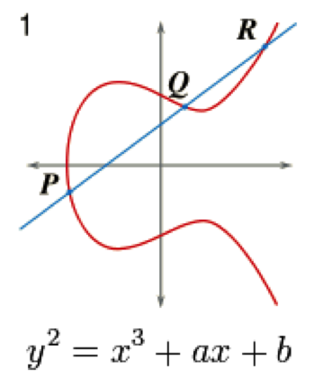
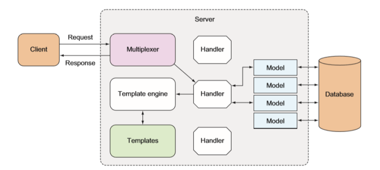

# Nomad Coders - Nomad Coin

<p align="center">
    
</p>

## Table of Contents

- [About](#about)
- [Getting Started](#getting_started)
- [Usage](#usage)
- [Notes](#notes)
- [Libs](#libs)
- [Docs](#docs)
- [Resources](#resources)

## About <a name = "about"></a>

A fully-featured blockchain and cryptocurrency using the Go programming language.

- [Take the course too!](https://nomadcoders.co/nomadcoin)
- [Certificate of Completion]()
- [Original code](https://github.com/nomadcoders/nomadcoin)

### Features

- [x] HTML Explorer
- [x] REST API
- [x] CLI
- [x] Database Backend
- [x] Mining
- [x] Transactions
- [x] Wallets
- [ ] P2P (Websockets)
- [ ] Unit Testing

## Getting Started <a name = "getting_started"></a>

### Prerequisites

Install the latest version of `Go`, then install external dependencies:

```bash
go get -u github.com/gorilla/mux
go get -u github.com/boltdb/bolt
go get -u github.com/evnix/boltdbweb
go get -u github.com/gorilla/websocket
```

### Installing

```bash
$ git clone https://github.com/librity/nc_nomadcoin
$ cd nc_nomadcoin
$ go run main.go both
```

Automagically analyze race conditions during execution:

```bash
$ go run -race main.go rest -port=5001
$ go run -race main.go rest -port=5002
# OR
$ go build -race && nc_nomadcoin rest -port=5001
$ go build -race && nc_nomadcoin rest -port=5002
```

## Usage <a name = "usage"></a>

### CLI

```bash
$ go run main.go rest -port=PORT                # Start the REST API (recommended)
$ go run main.go explorer -port=PORT            # Start the HTLM Explorer
$ go run main.go both -ePort=PORT -rPort=PORT   # Start both REST API and HTML Explorer
```

### HTLM Explorer

http://localhost:4000

### REST API

http://localhost:5001

### Web Sockets Chat demo

From the project's root run

```bash
$ go run examples/chat/*.go
```

Then open one of the demos in your web browser:

- Ping demo: http://localhost:7000/static/ping_demo.html
- Echo demo: http://localhost:7000/static/echo_demo.html
- Broadcast demo: http://localhost:7000/static/broadcast_demo.html

## Notes <a name = "notes"></a>

### Go Routines and Channels

- Reading from a channel without an active go routines will create a panic.
- Reading from a closed channel will return `nil`
  or the type equivalent (`0`, `""`, etc.)
- Closing a closed channel will create a panic.
- Sending to a closed channel will create a panic.
- Channels can be Read-only (`<-chan`) or Send-only (`chan<-`).
- Both sending and receiveing are blocking operations
  for unbuffered channels.
- Buffered channels have a non-blocking queue of messages
  (`make(chan int, BUFFER_SIZE)`).
  Sending and receiving become blocking operations once the queue is full.

### One-way hash functions

Deterministic, easy to compute, hard to invert:

```go
hashFunction("sexy") => "dsdj21321wq0wjdw0jw9djcosaniqij0"
hashFunction("sexy") => "dsdj21321wq0wjdw0jw9djcosaniqij0"
hashFunction("sexyy") => "ri3j9rj2302j0ginvin0n00ivwn0inv0u"
hashFunction("ri3j9rj2302j0ginvin0n00ivwn0inv0u") => UNDEFINED
```

### Blockchain

```go
newBlockHash := hashFunction(data + previousBlockHash + timestamp + ...)
```

`data` could be anything. Any alteration to a previous block's data will
avalanche obvious changes to the next blocks' hashes.

### Accounting model

We use the UTXO (Unspent Transaction Output) accounting model,
the same one used in BitCoin and Cardano.

Coins are created by a special type of transaction: the coinbase transaction.

```go
type Transaction struct {
	Id     string
	Input  []string
	Output []string
}

coinbaseTx = Transaction{
	Id:     "0001"
	Input:  []string{"$10(blockchain)"},
	Output: []string{"$10(miner)"},
}
```

Transactions have multiple inputs and outputs.
Input is the money you have before the transaction.
Output is the money everyone has by the end of the transaction.

```go
txs := []Transaction{}
txs = append(txs, Transaction{
	Id:     "0002"
	Input:  []string{"$10(lior),txId(0001)"},
	Output: []string{"$1(drugDealer)", "$2(landLord)", "$7(lior)"},
})
txs = append(txs, Transaction{
	Id:     "0003"
	Input:  []string{"$7(lior),txId(0002)"},
	Output: []string{"$7(waiFu)"},
})
```

A transaction Input is a reference to a previous transaction Output.
We can only use an Input from a previous Output
that's not being used by another transaction in the blockchain or the mempool:
An Output becomes "spent" once it's referenced by an Input.

### Mempool

Unconfirmed transactions wait on the _Mempool_ until they are added
to the blockchain by miners, becoming confirmed.

### Digital signing

1. Hash any digital object (string, picture, json, etc.)
2. Generate a Public-Private key pair
3. Sign the hash with the private key
4. Verify signature with the public key

```go
messageHash := hashFunction("i like turtles")
publicKey, privateKey := makeNewKeys()
signature := sign(messageHash, privateKey)
checksOut := verify(messageHash, signature, publicKey)
```

All these functions are cryptographic black boxes made with very cool math.
There are
[many different](https://en.wikipedia.org/wiki/Public-key_cryptography#Examples)
Public-key cryptography algorithms with which to sign and verify data.
We will use Elliptic-curve cryptography
with the [NIST P-256](https://neuromancer.sk/std/nist/P-256) curve,
while Bitcoin uses [Secp256k1](https://en.bitcoin.it/wiki/Secp256k1).

### Elliptic Curve Digital Signature Algorithm (ECDSA)

Public key is the (x,y) coordinates of a point in an elliptic curve:

<p align="center">
    
</p>

### Cryptocurrency Investment Advice

This what I've gathered from all my research, merely my opinion.

- Only bet what you can afford to loose.
- Don't bet on anything you don't understand.
- Don't bet on anything you haven't read the code.
- A blockchain is only as good as its dev community.
- Bet on engineering, not marketability.
- "I'm an adult and everything I do is my responsibility."
- Don't be this guy:

[](https://youtu.be/61i2iDz7u04)

## Libs <a name = "libs"></a>

- https://github.com/gorilla/mux
- https://github.com/gorilla/websocket
- https://github.com/boltdb/bolt

## Docs <a name = "docs"></a>

- https://pkg.go.dev/fmt#Printf
- https://pkg.go.dev/sync#Once
- https://pkg.go.dev/net/http#HandleFunc
- https://pkg.go.dev/log#Fatal
- https://pkg.go.dev/text/template#hdr-Actions
- https://pkg.go.dev/html/template#ParseFiles
- https://pkg.go.dev/path/filepath#Match
- https://pkg.go.dev/encoding/json#Marshal
- https://pkg.go.dev/strconv#Atoi
- https://pkg.go.dev/flag#NewFlagSet
- https://pkg.go.dev/encoding/gob
- https://pkg.go.dev/crypto/elliptic#P256
- https://pkg.go.dev/encoding/hex#DecodeString
- https://pkg.go.dev/math/big#Int
- https://pkg.go.dev/crypto/x509#MarshalECPrivateKey
- https://pkg.go.dev/os#WriteFile
- https://pkg.go.dev/builtin#close
- https://golang.org/doc/
- https://pkg.go.dev/std
- https://golang.org/ref/spec#Variables
- https://golang.org/ref/spec#Pointer_types
- https://tour.golang.org/methods/17

## Resources <a name = "resources"></a>

- https://github.com/LarryRuane/minesim
- https://mining-simulator.netlify.app/
- https://www.blockchain.com/explorer
- https://www.youtube.com/playlist?list=PL7jH19IHhOLOJfXeVqjtiawzNQLxOgTdq
- https://stackoverflow.com/questions/29762118/range-over-array-index-in-templates
- https://andybrewer.github.io/mvp/?ref=producthunt
- https://www.digitalocean.com/community/tutorials/how-to-add-a-favicon-to-your-website-with-html
- https://en.wikipedia.org/wiki/Marshalling_(computer_science)
- https://swagger.io/specification/
- https://en.wikipedia.org/wiki/Adapter_pattern
- https://github.com/google/leveldb
- https://github.com/LMDB/lmdb
- https://github.com/evnix/boltdbweb
- https://github.com/br0xen/boltbrowser
- https://developer.mozilla.org/en-US/docs/Web/HTTP/Status
- https://marketplace.visualstudio.com/items?itemName=humao.rest-client
- https://javascript.info/websocket
- https://developer.mozilla.org/en-US/docs/Web/API/WebSocket
- https://www.javatpoint.com/how-to-add-javascript-to-html
- https://stackoverflow.com/questions/4279611/how-to-embed-a-video-into-github-readme-md

### Go

- https://www.gorillatoolkit.org/
- https://dbdb.io/db/boltdb
- https://github.com/etcd-io/bbolt
- https://cobra.dev/
- https://www.digitalocean.com/community/tutorials/understanding-data-types-in-go
- https://stackoverflow.com/questions/25161774/what-are-conventions-for-filenames-in-go
- https://jogendra.dev/import-cycles-in-golang-and-how-to-deal-with-them
- https://hackthedeveloper.com/golang-server-static-files/
- https://stackoverflow.com/questions/19239449/how-do-i-reverse-an-array-in-go
- https://stackoverflow.com/questions/54858529/golang-reverse-a-arbitrary-slice
- https://github.com/golang/go/wiki/SliceTricks#reversing
- https://golangdocs.com/golang-mux-router
- https://stackoverflow.com/questions/40478027/what-is-an-http-request-multiplexer
- https://golangdocs.com/maps-in-golang
- https://golang.org/src/strconv/atoi.go?h=Atoi
- https://gist.github.com/miguelmota/2a0c0e96c22bccc8740819d5d64ff8d0
- https://stackoverflow.com/questions/14121422/de-and-encode-interface-with-gob
- https://golangdocs.com/generate-random-string-in-golang
- https://stackoverflow.com/questions/22892120/how-to-generate-a-random-string-of-a-fixed-length-in-go
- https://stackoverflow.com/questions/27267900/runtime-error-assignment-to-entry-in-nil-map
- https://stackoverflow.com/questions/14928826/passing-pointers-to-maps-in-golang
- https://stackoverflow.com/questions/2809543/pointer-to-a-map
- https://medium.com/golangspec/labels-in-go-4ffd81932339
- https://stackoverflow.com/questions/24757814/golang-convert-byte-array-to-big-int
- https://stackoverflow.com/questions/33832762/how-do-i-make-a-go-program-wait-until-there-is-user-input
- https://stackoverflow.com/questions/37334119/how-to-delete-an-element-from-a-slice-in-golang

### Go templates

- https://gowebexamples.com/templates/
- https://blog.gopheracademy.com/advent-2017/using-go-templates/
- https://stackoverflow.com/questions/25689829/arithmetic-in-go-templates
- https://stackoverflow.com/questions/17843311/template-and-custom-function-panic-function-not-defined
- https://stackoverflow.com/questions/38686583/golang-parse-all-templates-in-directory-and-subdirectories

### Cryptograhy

- https://en.wikipedia.org/wiki/Cryptographic_hash_function
- https://en.wikipedia.org/wiki/SHA-2
- https://www.tutorialspoint.com/cryptography/cryptography_digital_signatures.htm
- https://en.wikipedia.org/wiki/Public-key_cryptography
- https://www.youngwonks.com/blog/Public-Key-and-Private-Key-Encryption-Explained
- https://en.wikipedia.org/wiki/End-to-end_encryption
- https://en.wikipedia.org/wiki/Cryptocurrency_wallet
- https://en.wikipedia.org/wiki/Digital_signature
- https://en.wikipedia.org/wiki/Encryption
- https://en.wikipedia.org/wiki/Elliptic_Curve_Digital_Signature_Algorithm
- https://en.wikipedia.org/wiki/Elliptic-curve_cryptography
- https://safecurves.cr.yp.to/
- https://www.reddit.com/r/crypto/comments/7rithm/what_does_p256_stand_for/
- https://neuromancer.sk/std/nist/P-256
- https://askinglot.com/what-is-nist-p256
- https://askinglot.com/open-detail/108766
- https://csrc.nist.gov/publications/detail/fips/186/3/archive/2009-06-25

### Bitcoin

- https://bitcoinmagazine.com/technical/overview-bitcoins-cryptography
- http://blog.ezyang.com/2011/06/the-cryptography-of-bitcoin/
- https://en.bitcoin.it/wiki/Secp256k1

### Accounting models

- https://academy.horizen.io/technology/advanced/the-utxo-model/
- https://phemex.com/academy/what-are-utxo-unspent-transaction-output
- https://komodoplatform.com/en/academy/whats-utxo/
- https://iohk.io/en/blog/posts/2021/03/12/cardanos-extended-utxo-accounting-model-part-2/

### Favicons

- https://favicon.io/emoji-favicons/coin/
- https://www.freefavicon.com/
- https://icons8.com/icons/set/coin--animated
- https://www.ionos.com/tools/favicon-generator
- https://www.favicon-generator.org/search/---/Coin
- https://www.favicon.cc/?action=icon&file_id=138923

### Golang's `http.server` architecture

<p align="center">
    
</p>
